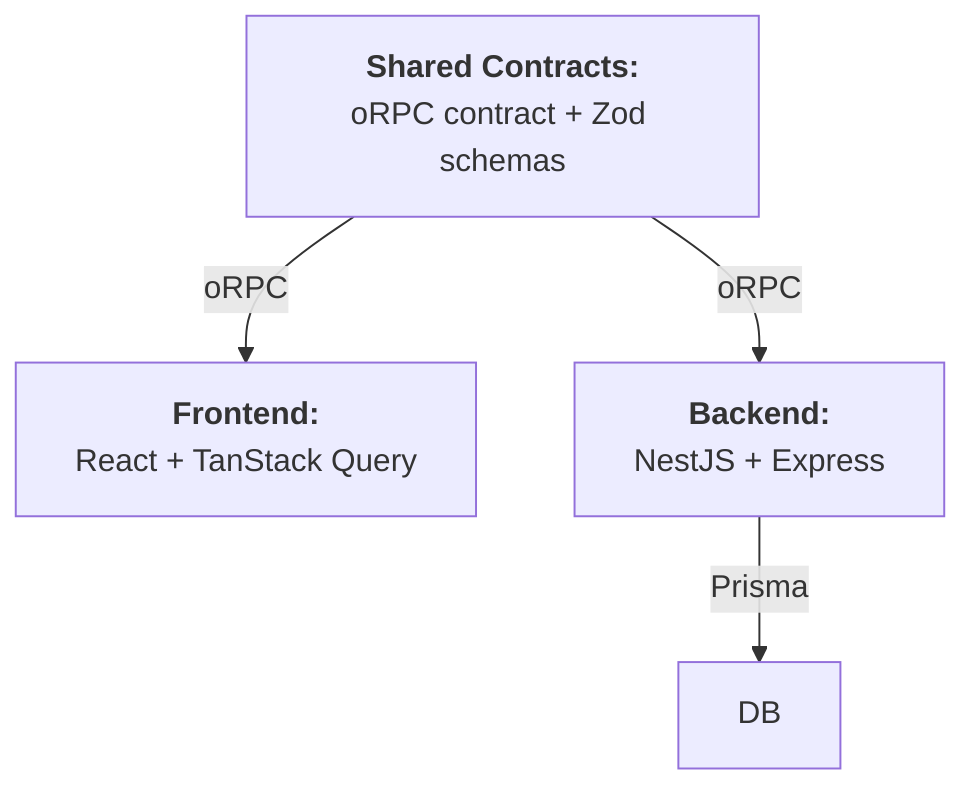

# Full Stack Template

A full stack template for bootstrapping maintainable and policy-compliant (WIP) web apps that enable developers to build fast.

## Key Features and Tools

### App

- End-to-end type safety:
  - Type-safe queries with [Prisma](https://www.prisma.io/)
  - Server-side runtime validation with [Zod](https://zod.dev/)
  - Type-safe APIs with [oRPC](https://orpc.dev/) on the [server](https://orpc.dev/docs/openapi/integrations/implement-contract-in-nest) and [client](https://orpc.dev/docs/openapi/getting-started)
- Clear, standardised architecture with [NestJS](https://nestjs.com/)
- Passwordless authentication:
  - OpenID-connect with Google OAuth
  - Email OTP
  - [Passkey authentication](https://safety.google/safety/authentication/passkey/) with configurable email re-verification requirement
- Secure session management

### Supporting Services

- [Dex IdP](https://dexidp.io/): OpenID Connect provider
- [Mailpit](https://mailpit.axllent.org/): Lightweight email testing tool

## Setup

### Pre-requisites

1. Install `nvm` using the the [official instructions](https://github.com/nvm-sh/nvm#installing-and-updating)
2. Install [Docker Desktop](https://docs.docker.com/desktop/setup/install/mac-install/)

### Dependencies
Install dependencies by running `pnpm i`.

### (Optional) Pi Coding Agent Setup

Install Pi globally using the [official instructions](https://pi.dev/docs/latest/quickstart). Then, start Pi to install extensions and start using it:

```bash
pi
```

## Usage

### Starting the App
Launch supporting services with `pnpm dev:infra:start`.

Start the backend:

```bash
cd backend
pnpm dev
```

Start the frontend in another shell:

```bash
cd frontend
pnpm dev
```

Access the app and supporting services at the following URLs:

- Frontend w/ proxy to backend: http://localhost:3000
- Backend: http://localhost:8080
- Mailpit inbox: http://localhost:8025
- Dex IdP: http://localhost:5556/dex - mainly for auth redirect

### Updating the DB Schema (Development)
After amending the schema in `backend/prisma/schema.prisma`:

- For quick incremental changes, run `pnpm db:sync`
- For a complete reset, run `pnpm db:reset && pnpm db:sync`

Thereafter, run seeds as required:

```bash
pnpm db:seed:run
```

### Creating Migrations
Generate a migration with `pnpm db:migration:gen` and provide a name in `snake-case`.

Then, run the migrations with `pnpm db:migration:run`.

Finally, re-generate the Prisma client with `npx prisma generate`.

### Seeding the DB
Amend `backend/prisma/seed.ts`, then run `pnpm db:seed:run`.

## Development
Refer to the [Development docs](./docs/index.md).

## Design

The app (backend + frontend) is designed with a **contract-first approach** in order to achieve **near-end-to-end type safety**.



### Contracts: Type Safety Between Backend and Frontend
The backend and frontend share **oRPC contracts** and **Zod schemas**. Together, these serve as a single source of truth for the API schema that both the backend and frontend must strictly follow. Zod schemas define the exact shape of inputs and outputs. oRPC routers define inputs and outputs using these schemas. Then:

- The backend implements the contract; and
- The frontend consumes the contract

This ensures type safety between the backend and frontend.

### Type-Safe ORM: Type Safety Between DB and Backend

The backend uses Prisma ORM. With auto-generated TypeScript types and deep query type inference, Prisma serves as a type-safe bridge linking the database schema to the backend application code.

### Remaining Gap: Zod vs. Prisma Types
There is still the risk of misalignment between Prisma types and Zod. There are no guarantees that the data returned from Prisma will match the required Zod schema. Errors can only be detected at runtime when the endpoint is called.

To close the remaining gap, bind the query result type to match Zod inputs for endpoints as required:

```ts
const SessionUserSchema = z.object({
  id: z.uuid(),
  name: z.string(),
})

async function getUser({ ... }) {
  const rawData: z.input<typeof SessionUserSchema> = await prisma.user.findUnique({ ... })

  return SessionUserSchema.parse(rawData)
}
```
