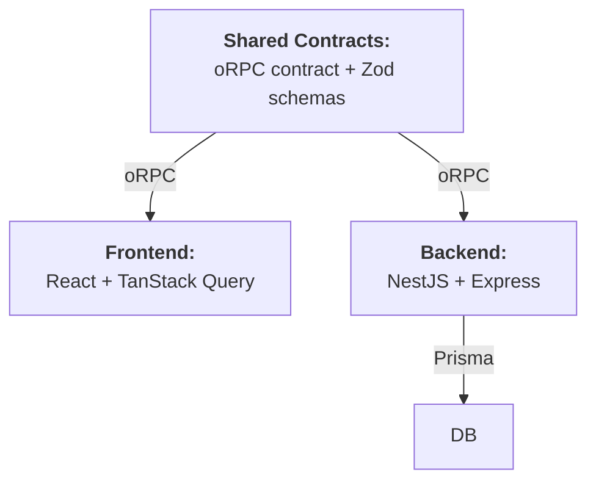

# Outline of App Architecture

The app (backend + frontend) is designed with a **contract-first approach** in order to achieve **near-end-to-end type safety**.



## Contracts: Type Safety Between Backend and Frontend
The backend and frontend share **oRPC contracts** and **Zod schemas**. Together, these serve as a single source of truth for the API schema that both the backend and frontend must strictly follow. Zod schemas define the exact shape of inputs and outputs. oRPC routers define inputs and outputs using these schemas. Then:

- The backend implements the contract; and
- The frontend consumes the contract

This ensures type safety between the backend and frontend.

## Type-Safe ORM: Type Safety Between DB and Backend

The backend uses Prisma ORM. With auto-generated TypeScript types and deep query type inference, Prisma serves as a type-safe bridge linking the database schema to the backend application code.

## Remaining Gap: Zod vs. Prisma Types
There is still the risk of misalignment between Prisma types and Zod. There are no guarantees that the data returned from Prisma will match the required Zod schema. Errors can only be detected at runtime when the endpoint is called.

To close the remaining gap, bind the query result type to match Zod inputs for endpoints as required:

```ts
const SessionUserSchema = z.object({
  id: z.uuid(),
  name: z.string(),
})

async function getUser({ ... }) {
  const rawData: z.input<typeof SessionUserSchema> = await prisma.user.findUnique({ ... })

  return SessionUserSchema.parse(rawData)
}
```
